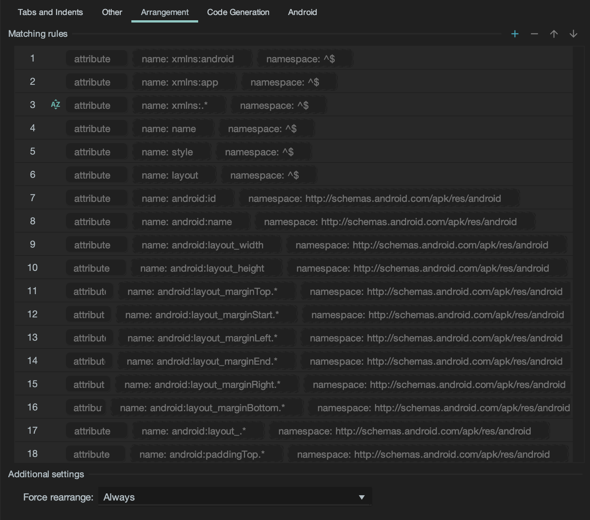

# Android Style Guide

Style Guide for Android Developers


## Getting Started

1. Download [CodeStyle.xml](./CodeStyle.xml)
2. AndroidStudio > Preferences > Editor > CodeStyle > Scheme > ... > Import Scheme
3. Select downloaded `CodeStyle.xml` 
4. OK to apply


## Kotlin

[Kotlin Coding Convention](https://kotlinlang.org/docs/reference/coding-conventions.html) 설정을 기본으로 합니다.

### Line Spacing

한 줄은 **100자**를 초과하지 않습니다.

- Argument가 많다면, 한줄에 하나의 Argument만 적어주세요.
- `import`  `class` 사이에는 **두 줄**을 띄웁니다.

```kotlin
...
import com.rainist.banksalad2.R


data class Rainist(
    careerPageUrl: String,
    banksaladPlayStoreUrl: String
)

val rainist = Rainist(
    "https://career.banksalad.com/",
    "https://play.google.com/store/apps/details?id=com.rainist.banksalad2"
)
```


### Function / Property

Argument 없는 function이 다음 조건을 모두 만족한다면, function 대신 property를 사용합니다.

If a function is/does...

- does not throw Exception
- is O(1) complexity
- is cheap or its computation result is being cached
- is idempotent operation

```kotlin
// Use Property
fun getMaxHeight(): Int = toolbar.height + someTextView.height // (X)
val maxHeight: Int = toolbar.height + someTextView.height // (O)

// Use Function
@Throws(TextViewNotFoundException::class)
fun filterTextViews(views: List<View>): List<View> {
    val textViews = views.filterIsInstance<TextView>()
    if (textViews.isEmpty()) {
        throw TextViewNotFoundException()
    }
    return textViews
}
```


### Network Request / Response

`:data` 레이어의 Network Response 객체는 다음 구조로 작성되어야 합니다.

```kotlin
data class SampleResponse(
    @SerializedName("id")
    val id: String, 
    @SerializedName("name")
    val name: String
): Response {
    companion object {
        val toEntity: Sample = Sample(id)
    }
}
```


### enum class

Response에 enum이 포함되어 있다면, `value` property를 만들고, Response 값으로 초기화 합니다.
Raw String을 Mapping해주는 Extension Function을 `:data` 레이어에 추가합니다.

```kotlin
// Entity Layer
enum class DeletedStatus(val value: String) {
    NORMAL("normal"),
    DELETED("deleted"),
    ;
 
    companion object {         
        fun from(rawValue: String): DeletedStatus =
            values().find { it.value == rawValue }!!
    }
}
 
// Data Layer
fun DeletedStatus.from(rawValue: String): DeletedStatus =
    values().find { it.value == rawValue }
```


### apply / run / with / let / also

특정 객체가 **3번 이상 사용되는 상황**에서만 사용합니다.

- 객체 자신을 반환할 때는 `apply` `also` 를 사용합니다.

- 반환 값이 없는 경우에는 `with` 를 사용합니다.

- `apply` `run` `with` 내부에서는 `let`을 사용합니다.

  - `let` argument는 named argument로 만듭니다.
  - `let` argument는 shadow 되지 않도록 합니다.
  - `it` 은 가장 안쪽 블록에서만 사용합니다.

  

### if / else

- `if` `else` 표현식 각각이 한 줄로 처리될 수 없다면 괄호로 감싸 블록을 만들어 줍니다.

- `if ~ else` 표현식을 통틀어 한 줄로 처리할 수 있는 경우에는 inline 으로 작성합니다.
- `if` 표현식이 블록으로 처리되었더라도, `else` 표현식을 한 줄로 처리할 수 있는 경우에는 inline 으로 작성합니다.

```kotlin
// Good
if (condition) ifExpression else elseExpression

// Good
if (condition) {
  ifBlockExpression
} else {
  elseBlockExpression
}

// Good
if (condition) {
  ifBlockExpression1
  ifBlockExpression2
} else {
  elseBlockExpression1
  elseBlockExpression2
}

// OK
if (condition) {
  ifBlockExpression1
  ifBlockExpression2
} else elseExpression

// Not Good
if (condition) ifExpression
else {
  elseBlockExpression1
  elseBlockExpression2
}
```


### when

자동 정렬 시, `->` 부분이 Vertically Align 됩니다.


### Intent

Intent를 생성하는 함수명은 `getIntent()`로 생성합니다.
`Activity` 등 화면 전환 동작을 하는 함수명에는 `start` 접두사를 붙입니다.


## XML

XML Style은 AndroidStudio 기본 XML 스타일을 기본으로 합니다.

### Arrangement

XML 태그 내의 각 속성들은 자동 정렬 적용 시 다음과 같은 순서로 배치됩니다:
**`SORT_BY_NAME`** 이 적혀진 항목은 해당 조건 내에서 Alphabetical Sort 처리됩니다.

1. `xmlns:android`
1. `xmlns:app`
1. **`SORT_BY_NAME`** `xmlns:.*`
1. `name`
1. `style`
1. `layout`
1. `android:id`
1. `android:name`
1. `android:layout_width`
1. `android:layout_height`
1. `android:layout_marginTop.*`
1. `android:layout_marginStart.*`
1. `android:layout_marginLeft.*`
1. `android:layout_marginEnd.*`
1. `android:layout_marginRight.*`
1. `android:layout_marginBottom.*`
1. `android:layout_.*`
1. `android:paddingTop.*`
1. `android:paddingStart.*`
1. `android:paddingLeft.*`
1. `android:paddingEnd.*`
1. `android:paddingRight.*`
1. `android:paddingBottom.*`
1. `android:width`
1. `android:height`
1. `android:viewportWidth`
1. `android:viewportHeight`
1. **`SORT_BY_NAME`** `android:.*`
1. `app:layout_constraintTop.*`
1. `app:layout_constraintStart.*`
1. `app:layout_constraintLeft.*`
1. `app:layout_constraintEnd.*`
1. `app:layout_constraintRight.*`
1. `app:layout_constraintBottom.*`
1. **`SORT_BY_NAME`** `app:layout_constraint.*`
1. `app:layout_constrainedWidth`
1. `app:layout_constrainedHeight`
1. **`SORT_BY_NAME`** `app:.*`
1. **`SORT_BY_NAME`** `.*`


### Snapshot





### View ID

`android:id` suffix는 해당 View Type을 사용합니다.

```xml
<TextView
    android:id="@+id/welcomeTextView"
    .../>
```


## Java

We don't. Use Default StyleGuide shipped with AndroidStudio


